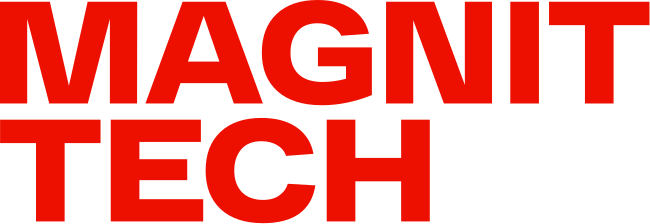

# Hi there, I'm Michael 👋
---

## 💼 Work Experience

### Sr. MLOps Engineer
  **Magnit Tech**, Moscow, November 2025 - Present

### SRE Engineer
  **K2 Cloud**, Moscow, April 2024 - November 2025

### Hardware Engineer
 **CROC inc.**, Moscow, August 2022 - April 2024

---

## 🛠 Skills

### Programming Languages

- Python
- Javа
- Bash
- Powershell

### Technologies & Frameworks

- Docker
- Kubernetes
- Prometheus, Grafana
- Hachicorp Vault, Consul
- RabbitMQ, Kafka
- Terraform, Ansible
- AWS
- RHEL, AlmaLinux, AstraLinux
- MS SQL Server, MySQL, PostgreSQL, ProxySQL
- Spring Framework

### Tools

- Git, Gitea, GitHub, GitLab
- VS Code
- Lens
- JetBrains IDEA, DataGrip, Pycharm
- Jira & Snow

---

## 📜 Certifications

- RH134 Red Hat System Administration II - HLD-0471
- RH294 Red Hat Enterprise Linux Automation with Ansible - HLD-0491

---

## 🎓 Education

**Bachelor degree in Information Systems and Technologies**  
  *Russian Technological University - MIREA, 2018-2022* 

---

## 📫 Contact Me

- 📧 **Email**: mickeytheseal@gmail.com
- 🌐 **Website**: work in progress

---

Thanks for visiting my profile! Feel free to reach out if you have any questions or if you'd like to collaborate on a project.

